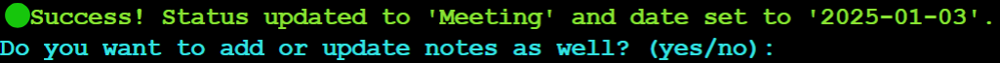

# Streamlining Leads Management in Notion ✉️

Welcome to my project for simplifying leads management in Notion!

I work at a B2B company, where I support the sales team by collecting leads, crafting tailored emails, and tracking follow-ups to book meetings. While Notion serves as our primary tool for managing these workflows, handling large datasets often feels cumbersome and slow.

To address these challenges, I developed a Python-based solution designed to simplify and accelerate my workflow. This program streamlines the management of leads — emails of professionals working in companies that match our target group — and makes the process of handling leads smoother, more efficient, and far less repetitive.

With this tool, I’ve saved significant time, reduced frustration, and transformed a clunky process into a seamless and productive experience.

# Table of content

1. [Introduction](#introduction)
    - [Background](#background)
    - [Workflows](#workflows)
    - [Databases Overview](#databases-overview)
    - [Project Goals](#project-goals)

2. [Project Overview](#project-overview)
    - [Requirements](#requirements)
    - [Flowchart](#flowchart)
    - [Key Features](#key-features)
    - [How To Use The Program](#how-to-use-the-program)
    - [User Experience](#user-experience)

2. [Program Structure](#program-structure)
    - [Notion API Integration](#notion-api-integration)
    - [Lead Class](#lead-class)
    - [Main Function](#main-function)
    - [Other](#other)
    - [Issues](#Issues)

3. [Tools and Technologies](#tools-and-technologies)
    - [Languages](#languages)
    - [Libraries](#libraries)
    - [Development Tools](#development-tools)
    - [Other Tools](#other-tools)

4. [Testing](#testing)
    - [Code Validation](#code-validation)
    - [Workflow Testing](#workflow-testing)
    - [Input Testing](#input-testing)
    - [Known Bugs and Limitations](#known-bugs-and-limitations)

5. [Future Improvements](#future-improvments)
    - [Automated Email Sending](#automated-email-sending)
    - [Integration with CRM Systems](#integration-with-crm-systems)
    - [Automated Reminders](#automated-reminders)
    - [Automatic Update of Latest Contact Date](#automatic-update-of-latest-contact-date)

6. [Deployment](#deployment)
    - [Verson Control](#verson-control)
    - [Page Deployment](#page-deployment)

7. [Credits](#credits)
    - [Content](#content)
    - [Other Credits](#other-credits)
    - [Acknowledgements](#acknowledgements)

# Introduction

## Background

I work at a B2B company, supporting the sales team by managing email outreach to leads. My role includes responsibilities like social media, website management, and marketing, which naturally brings in a steady stream of leads. My primary tasks involve collecting these leads (email addresses) from various channels, following up with tailored emails based on pre-defined templates, and tracking progress.

I rely on Notion to manage this workflow, including tracking which leads have been contacted, what email templates were sent, responses received, follow-up reminders, and the dates of contact. The ultimate goal is to convert leads into booked meetings with the sales team.

While Notion is an excellent tool that I use extensively for many tasks, I’ve found it somewhat cumbersome and inefficient for managing this specific process. Despite its limitations, I chose Notion to centralize all my data, but I’m fully aware it’s not the ideal platform for email workflow management.

With this Python project, my goal is to build a tool that simplifies, automates, and enhances this workflow, saving me time and effort while addressing Notion’s limitations for email management.

## Workflows

I have two main workflows in Notion; collecting leads, and managing leads. I designed my Python program to align seamlessly with these workflows, optimizing the processes I already have in place and rely on daily. By building on my existing structure, the program enhances efficiency without disrupting familiar routines.

These workflows are described in more detail below.

### Workflow 1: Collecting Leads

I typically start my workday by spending around 30 minutes gathering email addresses from channels where potential leads can be found, such as social media, our CRM system, the company website, or other platforms frequented by our target audience. These email addresses are then added to a list of potential leads to be contacted.

#### 📋 **Workflow step by step**

1. Find email that I find relevant to contact.
2. Check if email is in database already.
3. Add email to database if email isn't already there.
4. Add information about company and notes (if any)

#### 🤯 **Issues with this workflow**

When a Notion database becomes very full, I’ve noticed it tends to become sluggish and laggy, making data handling unnecessarily time-consuming. This is especially challenging in my case, where I need to view the entire database, which contains hundreds of data points. Beyond the performance issues, however, there is a significant limitation in Notion’s functionality: the lack of automatic duplicate detection for databases.

This shortcoming requires me to manually ensure that an email doesn’t already exist in the database before adding it. To do so, I must load all database rows — clicking "load more" repeatedly — and then manually search (Ctrl + F) for every email I want to add. Additionally, I need to verify that the company associated with the email is not already in our sales list. This involves switching to a separate database, loading its data in a similar manner, and manually searching for the company name. These extra steps, while manageable in isolation, become highly repetitive and time-consuming when performed daily.

Despite my diligence in double-checking, duplicates occasionally slip through — whether it’s the same email added twice or contacting a lead from a company that’s already in our sales list. This has resulted in scenarios where emails were sent redundantly, even to leads who had previously declined. An automated solution for detecting duplicates across both databases would save significant time, reduce errors, and streamline the entire workflow.

----

### Workflow 2: Updating existing emails

In my leads database, I keep track of each lead’s status and the dates of contact. When I send an email, I update the status to something like "E-mail 1," showing that the lead received an email using that template. I use several templates in my workflow. If a lead replies and we start a conversation, I change their status to something like "Meeting Booked" or "Not Interested" and note the date of the update.

If a lead doesn’t respond within a week, I send a reminder email, updating their status to something like "Reminder E-mail 1" and recording the date it was sent. I also update notes in the database regularly, adding details such as if a lead wants to be contacted later or has shown interest in a specific product. This helps me stay on top of all interactions.

My workflow isn’t fixed but adapts based on when I send emails or receive responses. As soon as a lead replies, I update the database immediately to ensure the information is always accurate. Since my sales team depends on this database, keeping it up-to-date is essential.

#### **🤯 Issues with this workflow**

When I send an email to a lead, or receive a reply from a lead, I have to open the database, repeatedly click "load more" to access all the rows, and wait for everything to load — a process that becomes slow with larger datasets.

Once the database is fully loaded, I use Ctrl+F to search for the specific email and update the information. While this process is relatively straightforward, repeating it multiple times a day quickly becomes tedious. Constantly reopening the database, waiting for it to load, and searching for emails disrupts the workflow and makes the process feel unnecessarily time-consuming.

Of course, keeping the database open all the time would help streamline this process. However, since I use Notion extensively for various tasks, I often navigate elsewhere and forget to keep the leads database ready, adding another layer of inefficiency to my daily workflow.

## Databases Overview

I have two databases in Notion, one for emails to potential new leads and one for current customers.

⚠️ This project uses dummy databases with fictional data to ensure privacy. The real database I work with daily includes additional columns like source (where the lead was found), SNI code (a Swedish industry classification), and interest (indicating which sales offers are relevant based on factors like website activity). It also has more statuses, such as additional email templates and options like "Do not contact" or "Need to book a meeting." For simplicity, this project only includes the essential columns and basic statuses.

### Database 1: Email list


[SEE DATABASE LIVE HERE](https://sedate-molybdenum-41d.notion.site/auto-emails-168284e4604f806eb9a7dcdc7e005e9b?pvs=4)

This is a list of email addresses. While the emails here are fictional, they accurately represent the structure of my real leads database. This is where I gather all the leads I identify and track their status, notes, and other relevant details. The database consists of five columns, which are described below.

| Column | Description | 
| ------- | ---------- | 
| **E-mail** | The email address of the potential lead. | 
| **Company** | The company where the lead works. This is important for our B2B operations as we check it against the company sales list database. More details provided below. |
| **Status** | Tracks the lead's status, such as whether an email has been sent, if they’ve responded, or if a meeting has been booked. Additional details are outlined below. | 
| **Latest Contact** | Records the date of the most recent interaction with the lead. This is key for scheduling reminder emails to leads who haven’t replied. | 
| **Notes** | A space to log additional information about the lead, such as specific preferences or follow-up actions. | 

The status column has specific options to choose from. The status can only be one of the following statuses:

| Status | Description | Tag |
| ------- | ----------- | --------------- |
| **Not sent** | Indicates that no email has been sent to the lead yet. |  |
| **E-mail 1** | Shows that an email based on template 1 has been sent to the lead. |  |
| **E-mail 2** | Reflects that a follow-up email based on template 2 has been sent to the lead. |  |
| **E-mail 3** | Indicates that another follow-up email, this time based on template 3, has been sent to the lead. |  |
| **Meeting** | Means that a meeting has been successfully booked with the lead. |  |
| **Not Interested** | Indicates that the lead has explicitly expressed they are not interested in the offer or product. |  |

### Database 2: Company sales list


[SEE DATABASE LIVE HERE](https://sedate-molybdenum-41d.notion.site/company-database-168284e4604f80aca775d10d51bce604?pvs=4)

This database showcases all the companies we are already selling to. These are businesses where our Key Account Managers are actively engaged in conversations or ongoing sales. As such, I don’t need to include these companies in my lead management process, ensuring my focus remains on new opportunities.

This database is intentionally simple, containing only the companies that are our current customers. As a B2B company, we focus on tracking companies rather than individual contacts within them. The primary purpose of this database is to ensure that leads in the email list are not already existing customers.

There have been discussions about complementing this database with additional information, such as contact persons and which salesperson is responsible for the account. However, this information serves no purpose for me in my role. My primary concern is determining whether a company is already in our sales list, ensuring I don’t contact individuals at companies we are already selling to. This database is critical for preventing overlap between leads and existing customers, ensuring our email outreach is efficient and focused.

This list isn’t updated frequently, and when updates are needed, I can handle them manually. For now, I’ve chosen not to include this database in the Python program, as there are other areas where Python automation provides far greater efficiency and impact.

## Project Goals

Now that we've outlined the databases, workflows, and current issues with the workflow, let's focus on what we aim to achieve with this project. The goal is to streamline and simplify the process of managing leads while addressing the inefficiencies and limitations of the current system. This tool should enable a quick and seamless workflow, allowing for efficient handling of leads without unnecessary complexity or delays.

**Below is an overview of the primary goals for the project:**

| Goal | Description | 
| ------- | ---------- | 
| **Add New Leads** | Provide a quick and easy way to add new email leads to the database with minimal effort. | 
| **Automatic Duplicate Checker** | Ensure no duplicate emails are added by automatically checking if the email already exists. | 
| **Company Sales List Checker** | Automatically check if the lead belongs to a company we already sell to, avoiding redundant outreach. |
| **Update Email Status** | Simplify the process of updating the status and contact date of an email lead. |
| **Update Notes** | Make it easy to update or add notes for existing leads to keep track of relevant details. |
| **Minimal Options and Text** | Keep the workflow simple and to the point, avoiding unnecessary text or options for a fast UX. |
| **Clear Feedback** | Provide immediate and clear feedback to instantly confirm whether the expected action was successful or if an issue, like a duplicate, occurred. |

The overarching goal is to create a tool that integrates seamlessly into the current workflow, saving time and effort while providing the necessary features to manage leads effectively. This project aims to prioritize simplicity, speed, and usability for daily tasks.

# Project Overview

## Requirements

This requirements list outlines the specific functionality and features that this program must deliver to meet the project goals. Each requirement has been tailored to address the challenges described in the project's background and workflow, focusing on simplicity, speed, and accuracy. This list of requirements serves as the foundation for the program's development.

| Requirement | Description | 
| ------- | ---------- | 
| **Notion API Integration** | Use the Notion API to interact with two separate databases (leads and company sales list). This includes searching, retrieving, adding, and updating data efficiently. | 
| **Add New Leads** | The program must allow the user to input a new email address, company name, and optional notes, and add these to the leads database. | 
| **Duplicate Email Check** | Before adding a new email, the program must automatically search the leads database for the email. If the email is there, don't add the email to leads database. | 
| **Block Invalid Emails** | Validate email addresses using a predefined format and reject invalid entries with a clear error message. | 
| **Handle Optional Company Input** | Allow the user to optionally input a company name when adding a new lead, and verify against the company sales list database if provided. |
| **Company Sales List Check** | The program must automatically search the company sales list database to check if the lead’s company is already a customer. If it is, don't add the email to leads database. |
| **Update Lead Status** | The program must allow users to update the status field of a lead with predefined options. |
| **Update Notes** | The program must provide an option to either add to or completely replace the notes field for an existing lead. |
| **Immediate Feedback** | After every action, the program must display a message confirming success or failure. |
| **Error Handling for Inputs** | If the user inputs an invalid email, status, or note action, the program must display a clear error message and prompt the user to retry. |
| **Date Auto-Update** | When updating a lead's status, the program must automatically update the "Latest Contact" field with the current date. |
| **Efficient Database Loading** | The program must bypass Notion’s "load more" limitation by directly querying the full database via the API. |
| **Seamless Database Switching** | If a company check is required, the program must automatically switch to the company sales list database and return to the leads database afterward. |
| **Predefined Status Options** | The program must restrict status updates to a fixed set of options (e.g., "Not Sent," "E-mail 1," "Meeting Booked") to maintain data consistency. |

## Flowchart


This flowchart, created in Adobe XD, illustrates the basic process for adding or updating leads in the program. The focus is on minimizing steps and creating an efficient, user-friendly flow. Using a flowchart as a visual representation allows me to clearly see the logical flow of the program, helping me break down workflows into manageable steps. 

| Shape/Color | Meaning | 
| ------- | ---------- | 
| **Circle** | Represents the start or end of the flow. | 
| **Diamond** | Represents a decision point in the workflow, such as yes/no or multiple choices. | 
| **Rectangle** | Represents an input or print step. | 
| **Purple** | Represents a program action, such as checking the database or displaying a message. | 
| **Grey** | Represents a user action, such as entering an email or selecting a status. | 

### Key aspects to note

| Feature | Description | 
| ------- | ---------- | 
| **Seamless Workflow** | The program is designed to loop in a way that aligns with my workflow. For example, if I try to add an email that already exists in the leads database, I want the program to prompt me to re-enter a new email instead of sending me back to the start. This ensures continuity in the "add leads" process. | 
| **Error Handling** | Similarly, if I for example add an email associated with a company already in the sales list or attempt to update a lead that doesn’t exist in the database, I want clear error messages and the ability to quickly retry without disrupting the workflow. | 
| **No Hard Stops** | The program is intentionally designed to never "stop" or "end". Once I successfully complete an action — such as adding a new lead or updating a lead’s information — the program should seamlessly return to the beginning, ready for the next input. | 

## Key Features

This program was built to simplify and streamline the workflow of managing leads in Notion. Below are the key features that have been implemented, highlighting what the program can do and how it aligns with the initial requirements and flowchart. Any deviations or additions have been noted.

| Feature | Description | 
| ------- | ---------- | 
| **Adding New Leads** | 1. Easily add new leads to the leads database with minimal input required.<br>2. Includes optional fields for company name and notes. <br>3. Automatically set status "Not sent" and leave date field empty. | 
| **Automatic Leads Duplicate Check** | 1. Automatically checks for duplicate emails in the leads database when adding new leads.<br>2. Prevents duplicates from being added.<br>3. Shows clear error messages if duplicates are detected.<br>4. Displays success messages for non-duplicates. | 
| **Automatic Company Sales List Check** | 1. Verifies whether a company associated with a lead already exists in the sales list database. <br>2. Prevents leads from being added if their company is an existing customer.<br>3. Shows clear error messages if a company is already in the sales list.<br>4. Displays success messages when the company is not in the sales list. | 
| **Update Status for Existing Leads** | 1. Allows users to update the status of a lead (e.g., "E-mail 1," "Meeting") based on predefined options. <br>2. Displays the current status before updating.<br>3. Shows possible statuses to choose from. <br>4. Allows users to immediately update notes after status updates to fit the normal workflow. | 
| **Date Auto-Update** | 1. Automatically updates the "Latest Contact" field whenever a lead's status changes. <br>2. Uses the current date dynamically for updates. | 
| **Update Notes for Existing Leads** | 1. Enables users to add or replace notes for existing leads.<br>2. Displays current notes before input for clarity. | 
| **Clear and Immediate Feedback** | 1. Provides clear, concise feedback for all actions, such as successful updates, errors, or duplicate detections.<br>2. Ensures users always know whether the intended action was successful or requires adjustments. | 
| **Minimal User Interaction** | 1. Designed to minimize inputs and steps, aligning with the quick workflow needed for sales management. <br>2. Loops processes to allow users to fix errors without restarting the workflow. | 
| **Enhanced User Experience** | 1. Uses color-coded feedback (via Colorama, more information below) to highlight important information. <br>2. Error messages and success confirmations are designed to provide all necessary information without overwhelming the user. <br>3. Emojis enhance feedback, making it easier to recognize successes or issues.| 
| **Colored Messages** | 1. Differentiates program output from user input by using cyan for program messages and white for user input. <br>2. Error messages are displayed in red for immediate attention. <br>3. Success messages are displayed in green to confirm successful actions. |
| **Input Error Handeling** | 1. Prevents invalid inputs, such as missing "@" in email addresses.<br>2. Prompts users to try again if an input is invalid. <br>3. Skips unnecessary inputs without generating errors. | 
| **Avioding Breaks** | 1. Ensures the program never stops abruptly or loops back to the beginning when errors happen. | 

----

### Changes from Initial Requirements or Flowchart

✅ **More Feedback Messages**<br>Additional confirmation and error messages were added to enhance user clarity.

✅ **Improved Error Handling**<br>The program ensures smooth loops when invalid inputs occur, rather than requiring users to start over.

✅ **Focus on UX**<br>The color-coded system and reduced steps were optimized beyond the initial requirements to ensure the program feels intuitive and fast.

✅ **Enhanced Input Validation**<br>The program ensures that user inputs are accurate by verifying key details, such as confirming that an email address is valid and that the status selected matches predefined options. This prevents incorrect or invalid data from being added to the database, maintaining its integrity and reliability.

✅ **Optional to add Company**<br>Due to my workflow, I chose to have company as an optional input when adding new leads. I don't always have information about the company where this person works.

## How To Use The Program

This program is deployed via Heroku and can be accessed here: [Auto Emails Application](https://auto-emails-e92e0f29caf5.herokuapp.com/)

To view the leads database and verify that leads are being added or updated, visit: [Leads Database](https://sedate-molybdenum-41d.notion.site/auto-emails-168284e4604f806eb9a7dcdc7e005e9b?pvs=4)

To access the company sales list database and ensure accuracy in the workflow, visit: [Company Database](https://sedate-molybdenum-41d.notion.site/company-database-168284e4604f80aca775d10d51bce604?pvs=4)

### How to add a lead


Adding a lead to the database is a straightforward process with minimal steps, designed for efficiency. Below is a step-by-step guide on how to add a lead:

1. **Start the program**<br>Launch the program with Heroku app here: [Auto Emails Application](https://auto-emails-e92e0f29caf5.herokuapp.com/)
2. **Choose "Add"**<br>When asked `Do you want to add or update email? (add/update):` type `add` and press enter.
3. **Enter Email**<br>Type the email you want to add. If it already exists, you’ll see a red message and can re-enter a new email. If it’s new, you’ll see a green confirmation.
4. **Enter Company (Optional)**<br>Add the company name or press enter to skip. If the company is in the sales list, you’ll be asked to try again with a different email. Otherwise, you’ll get a green confirmation.
5. **Add Notes (Optional)**<br>Add any relevant notes or press enter to leave it blank.
6. **Done!**<br>A green success message confirms the lead was added. You can verify this here: [Leads Database](https://sedate-molybdenum-41d.notion.site/auto-emails-168284e4604f806eb9a7dcdc7e005e9b?pvs=4)

----

### How to update a lead


Updating a lead provides more options compared to adding a lead since you might only want to update the status, the notes, or both. In my workflow, I always update the status first when both need to be changed. Here’s a step-by-step guide to updating a lead:

1. **Start the program**<br>Launch the program with Heroku app here: [Auto Emails Application](https://auto-emails-e92e0f29caf5.herokuapp.com/)
2. **Choose "Update"**<br>When asked `Do you want to add or update email? (add/update):` type `update` and press enter.
3. **Enter Email**<br>Type the email you want to add. If the email is found in the database, you'll proceed to the next step. If the email is not found, you'll receive an error message and be asked to re-enter an email.
4. **Choose what to update**<br>You'll be asked: `Do you want to update status or notes? (status/notes):`. Type `status` to update the lead's status. Type `notes` to update the lead's notes directly.
5. **Update the status (if applicable)**<br>If you choose to update the status, the program will display the current status and valid options (e.g., `Not sent` `E-mail 1` `Meeting`). Enter the new status from the list of valid options. The program will automatically update the status and set the latest contact date to the current date.
6. **Choose to update notes after status update (if applicable)**<br>After updating the status, the program will ask `Do you want to add or update notes as well? (yes/no):`. Type `yes` to proceed with updating the notes. Type `no` if you don’t want to update the notes.
7. **Update the notes (if applicable)**<br>If you choose to update the notes, the program will show the current notes. You'll be asked `What do you want to do with the notes? (add/replace):`. Type `add` to add new notes to the existing ones. Type `replace` to overwrite the current notes. Enter the new note content when prompted.
6. **Done!**<br>A green success message confirms the lead was updated. You can verify this here: [Leads Database](https://sedate-molybdenum-41d.notion.site/auto-emails-168284e4604f806eb9a7dcdc7e005e9b?pvs=4)


## User Experience

The program is designed to prioritize speed, clarity, and precision for both adding and updating leads. The following features ensure a smooth and efficient workflow:

### Adding and Updating Leads

| **Feature**                 | **Description**                                                                                                                                         | **Example**                             |
|-----------------------------|---------------------------------------------------------------------------------------------------------------------------------------------------------|-----------------------------------------|
| **Efficiency**              | Both adding and updating leads are designed to be quick, with minimal fields to fill and optional inputs, such as company name, that can be skipped.    |  |
| **Clear Feedback**          | The program provides instant feedback, indicating if an email already exists, if the associated company is in the sales list, or if actions succeeded. |  |
| **Action Confirmation**     | Success messages confirm completed actions with concise text and an emoji for easy recognition.                                                        |   |
| **Relevant Information Only** | When updating leads, the program displays only essential details, such as current status and notes, reducing distractions.                           |  |
| **Clear Error Messages**    | Error messages use emojis to make failures immediately clear, along with explanations and guidance on resolving the issue.                             |     |
| **Feedback After Every Action** | Updates to status and notes are confirmed separately, ensuring transparency and control through the entire process.                                  |   |

### Colorama

Colorama is an integral part of this program, enhancing the user experience with color-coded feedback in the terminal. It helps users quickly identify messages by their type, ensuring clarity and reducing confusion during interactions. In addition to colors, I use emojis to emphasize the success or failure of actions, making feedback both functional and visually intuitive.

#### Colors

| **Color** | **Description** |
| --------- | --------------- |
| **Cyan** | Used for all program prompts to differentiate them from user inputs, this ensures the program’s messages are easily identifiable. | 
| **Green** | Indicates successful actions, such as adding a lead to the database or confirming that a company is not in the sales list. | 
| **Red** | Highlights errors or unexpected outcomes, such as duplicate emails or invalid inputs. | 

#### Emoji Usage

🟢 **Green Circle:** Used in success messages to confirm that an expected action was completed, such as adding a new lead successfully.<br>
🔴 **Red Circle:** Always paired with error messages to signify that an expected action did not occur.

#### Installation of Colorama

Colorama was installed using the following command, as outlined in the [official Colorama documentation](https://pypi.org/project/colorama/):

`pip install colorama`

And import colors and styling to run.py with:

`from colorama import Fore, Back, Style`

I also ensured the Colorama library was included in the `requirements.txt` file, which was necessary for deploying the program on Heroku. This allows the program to run smoothly in the cloud environment.

This simple installation allowed for immediate access to Colorama’s features, making it easy to implement clear, color-coded messages throughout the program.

# Program Structure

The program is built around a Notion API integration, a Lead class for managing data, and a main function that serves as the entry point for user interaction. Below, I'll describe the key components of the program, highlight their functionality, and include code snippets for better understanding.

## Notion API Integration

The program uses the Notion API to interact with two separate databases. I integrated it into my program by following the [Notion Developers Get Started Guide](https://developers.notion.com/docs/getting-started)  and utilizing the [Notion API library](https://github.com/ramnes/notion-sdk-py). 

``` 
from notion_client import Client

Initialize Notion client
notion = Client(auth=creds["NOTION_TOKEN"]) 
```
The Notion token is stored in `creds.json`, which is hidden for privacy reasons.

## Lead Class

The Lead class encapsulates the logic for managing leads. It interacts with the Notion API to perform CRUD (Create, Read, Update, Delete) operations.

**Why use a class?**<br> It keeps the code modular and reusable, and aldo encapsulates lead-specific logic (e.g., validation, database queries).

### Code Example: Adding a New Lead

``` 
    def create(self, email, company=None, notes=None):
        """
        Add a new lead to the database.
        """
        properties = {
            "E-mail": {"title": [{"text": {"content": email}}]},
        }
        if company:
            properties["Company"] = {
                "rich_text": [{"text": {"content": company}}]
            }
        if notes:
            properties["Notes"] = {
                "rich_text": [{"text": {"content": notes}}]
            }

        self.notion.pages.create(
            parent={"database_id": self.database_id}, properties=properties
        )
        print(
            format_text(
                f"🟢 Success! Lead '{email}' added to the database.",
                color="green",
            )
        )
``` 

### Functions vs Class

Initially, I structured my program using standalone functions to handle email validation, database queries, and updates. While this approach worked, it quickly became evident that managing multiple related functions was inefficient and repetitive. By switching to a class-based approach, I consolidated related functionality, improved code readability, and enhanced maintainability.

#### **Initial Approach: Standalone Functions**

Below is an example of how I initially managed the functionality using separate functions:

```
def is_valid_email(email):
    """Check if email is valid."""
    pattern = r"^[a-zA-Z0-9._%+-]+@[a-zA-Z0-9.-]+\.[a-zA-Z]{2,}$"
    return bool(re.match(pattern, email))

def find_email_in_database(email):
    """Check if email exists in the email database."""
    response = notion.databases.query(database_id=database_id)
    for page in response["results"]:
        properties = page["properties"]
        if properties["E-mail"]["title"][0]["text"]["content"] == email:
            return page["id"]
    return None

def add_email_to_database(email, company=None, notes=None):
    """Add email to database."""
    properties = {
        "E-mail": {"title": [{"text": {"content": email}}]},
    }
    if company:
        properties["Company"] = {"rich_text": [{"text": {"content": company}}]}
    if notes:
        properties["Notes"] = {"rich_text": [{"text": {"content": notes}}]}

    notion.pages.create(
        parent={"database_id": database_id},
        properties=properties,
    )
    print(f"🟢 Success! '{email}' has been added to the database.")
```

While functional, this approach caused repetitive code, making it harder to maintain or scale as new features were added.

----

#### **Improved Approach: Class-Based**

By introducing a  `Lead` class, I encapsulated all lead-related operations into a single structure, improving organization and reducing redundancy.

Code example from `Lead` class:

``` 
     def __init__(self, notion_client, database_id, company_database_id):
        """
        Set the Lead Class with Notion client and database IDs
        """
        self.notion = notion_client
        self.database_id = database_id
        self.company_database_id = company_database_id

    def is_valid_email(self, email):
        """
        Validate the format of an email address.
        """
        pattern = r"^[a-zA-Z0-9._%+-]+@[a-zA-Z0-9.-]+\.[a-zA-Z]{2,}$"
        return bool(re.match(pattern, email))

    def find_by_email(self, email):
        """
        Search for a lead in the email database by their email.
        """
        response = self.notion.databases.query(database_id=self.database_id)
        for page in response["results"]:
            email_property = page["properties"]["E-mail"]
            email_title = email_property["title"][0]["text"]["content"].lower()
            if email_title == email.lower():
                return page  # Return the full page object
        return None

    def is_company_in_sales_list(self, company):
        """
        Search for company in the current company sales list.
        """
        response = self.notion.databases.query(
            database_id=self.company_database_id
        )
        for page in response["results"]:
            company_property = page["properties"]["Company"]
            company_title = company_property["title"][0]["text"]["content"]
            if company_title.lower() == company.lower():
                return True
        return False
```

----

#### Outcome

Switching to a class-based code not only simplified the structure but also ensured the program could be extended more easily in the future. For example, methods like `find_by_email`, `is_company_in_sales_list`, and `update_notes` are now part of the `Lead` class, providing a cohesive way to interact with leads.

## Main function

The `main()` function handles the user interaction loop. It allows users to add leads (prompts for email, company, and optional notes) and update leads (lets users modify the status or notes of an existing lead).

**Flow Example in `main():`**

```
            if action == "add":
                # Check if email is in database
                if lead_manager.find_by_email(email):
                    print(
                        format_text(
                            f"🔴 Email '{email}' already exists in "
                            "the database. Please enter a new email.",
                            color="red",
                        )
                    )
                    continue

                print(
                    format_text(
                            "🟢 Good to go! "
                            f"'{email}' does not exist in the database.",
                            color="green",
                    )
                )
```

## Other

To avoid repetition, a function `format_text` was created for formatting messages in the terminal. This ensures consistent color coding and bold styling.

**Before:**
```
print("\033[1m" + Fore.RED + "Error message" + Style.RESET_ALL + "\033[0m")
```

**After:**
```
print(format_text("Error message", color="red"))
```

## Issues

During development, I encountered a few challenges:

| **Issue** | **Description** | **Solution** |
| --------- | --------------- | ------------ |
| **Handling Loops in the Main Function** | I needed the program to loop back to specific points after errors, or back to start, e. g., when not wanting to add notes. | To achieve this, I implemented nested loops and a recursive call to main() within the loop to return to the starting point. While this solution works, it feels suboptimal and somewhat clunky since calling the main function within itself isn't the cleanest approach. It's functional for now but could benefit from a more elegant solution in the future. |
| **Formatting Message Repetition** | Initial implementation repeated formatting logic for every message. | Created the ```format_text``` function to simplify message styling. | 
| **Notion Select Type Issue** | Notion uses two types of select fields, one "select" and one "status". The program was trying to update with the wrong type, causing an error. | Updated the code to use the "status" type for the Notion select field. | 
| **Repetitive Notes Code** | The handling of notes appears in two places: one after updating the status and another when adding notes directly. This results in repetitive code. | A potential solution is to create a dedicated function or method for managing notes, which can be reused in both scenarios to improve maintainability and reduce redundancy. However, this has not yet been implemented in the current version of the program. | 


# Tools and Technologies

## Languages

- **Python**<br>The main programming language used in this project.

- **HTML, CSS, JavaScript**<br>Provided from the [Code Institute P3 Template](https://github.com/Code-Institute-Org/p3-template).

## Libraries

- **json**<br>Parses the `creds.json` file to extract Notion API credentials securely.

- **notion_client**<br>Facilitates interaction with the Notion API, enabling CRUD (Create, Read, Update, Delete) operations in Notion databases. Documentation: [Notion SDK for Python](https://github.com/ramnes/notion-sdk-py).

- **re**<br>Validates email addresses to ensure data integrity and prevent invalid entries in the database. Documentation: [re library](https://docs.python.org/3/library/re.html). 

- **datetime**<br>Tracks and records the date of the latest interaction with leads for accurate updates. Documentation: [datetime](https://docs.python.org/3/library/datetime.html). 

- **colorama**<br>Enhances the terminal interface by adding color-coded feedback, making user interactions more intuitive. Documentation: [colorama](https://pypi.org/project/colorama/). 

## Development Tools

- **Gitpod**<br>Used for writing and testing the Python code in an online IDE environment.

- **GitHub**<br>For version control and repository management throughout the development process.

- **Heroku**<br>Deployed the program to Heroku for easy online access and testing.

## Other Tools

- **Notion**<br>The core database platform integrated with the project, serving as the leads database and company sales list for email tracking and management.

- **Python Interpreter**<br>Used locally for testing the program before deployment to Heroku.

- **Adobe XD**<br>Utilized to design the project’s flowchart, visually representing the program's logic and workflows.

- **ChatGPT**<br>Assisted in debugging, troubleshooting, and explaining unexpected behavior. Also provided guidance on best practices and solutions for cleaner, more efficient, and maintainable code.

# Testing

## Code Validation


The code was validated using the [CI Python Linter](https://pep8ci.herokuapp.com/#). Initially, a few lines were flagged for exceeding the recommended length, but these issues have since been resolved. The code now passes validation without any errors or warnings, meeting all style and formatting guidelines.

 

The code was run through a [Python syntax checker](https://extendsclass.com/python-tester.html) with no errors.

## Workflow Testing

To evaluate whether the program meets the goals and requirements outlined earlier, we conducted a thorough review of each feature. Below is a detailed checklist of the requirements, descriptions, and whether the program successfully implemented them.

| Requirement | Description | Implemented Successfully? | 
| ------- | ---------- | ---------- | 
| **Notion API Integration** | Use the Notion API to interact with two separate databases (leads and company sales list). This includes searching, retrieving, adding, and updating data efficiently. | ✅ Yes | 
| **Add New Leads** | The program must allow the user to input a new email address, company name, and optional notes, and add these to the leads database. | ✅ Yes | 
| **Duplicate Email Check** | Before adding a new email, the program must automatically search the leads database for the email. If the email is there, don't add the email to leads database. | ✅ Yes | 
| **Block Invalid Emails** | Validate email addresses using a predefined format and reject invalid entries with a clear error message. | ✅ Yes | 
| **Handle Optional Company Input** | Allow the user to optionally input a company name when adding a new lead, and verify against the company sales list database if provided. |✅ Yes | 
| **Company Sales List Check** | The program must automatically search the company sales list database to check if the lead’s company is already a customer. If it is, don't add the email to leads database. | ✅ Yes | 
| **Update Lead Status** | The program must allow users to update the status field of a lead with predefined options. | ✅ Yes | 
| **Update Notes** | The program must provide an option to either add to or completely replace the notes field for an existing lead. | ✅ Yes | 
| **Immediate Feedback** | After every action, the program must display a message confirming success or failure. | ✅ Yes | 
| **Error Handling for Inputs** | If the user inputs an invalid email, status, or note action, the program must display a clear error message and prompt the user to retry. | ✅ Yes | 
| **Date Auto-Update** | When updating a lead's status, the program must automatically update the "Latest Contact" field with the current date. | ✅ Yes | 
| **Efficient Database Loading** | The program must bypass Notion’s "load more" limitation by directly querying the full database via the API. | ✅ Yes | 
| **Seamless Database Switching** | If a company check is required, the program must automatically switch to the company sales list database and return to the leads database afterward. | ✅ Yes | 
| **Predefined Status Options** | The program must restrict status updates to a fixed set of options (e.g., "Not Sent," "E-mail 1," "Meeting Booked") to maintain data consistency. | ✅ Yes | 

## Input Testing 

This program has a total of xx user inputs. Each input has been tested according to the list below. The test results are below.

**Validation Test for Inputs:**
- a letter `a`
- multiple letters `abc`
- a number `1`
- multiple numbers `123`
- an empty ENTER with nothing `ENTER`
- only spaces
- special characters `?` `!` `@`

| Input | Purpose | Expected Behavior | Outcome | Validation Passed? | Screenshot | 
| ------- | ---------- | ---------- | ---------- | ---------- | ---------- | 
| **Input 1: Add or update lead** | Input that asks if the user wants to add or update a lead | Only accept  `add` or `update`. All other inputs should give error. | ✅ Works as expected | ✅ Yes |  | 
| **Input 2: Enter email** | Collect the email address for the lead | Must include `@` and `.`, no spaces, special characters, or invalid formats. Test through re library. | ✅ Works as expected | ✅ Yes |  | 
| **Input 3: Enter company name** | Collect an optional company name | Accept all characters, including special characters and numbers. `ENTER` skips input. | ✅ Works as expected | ✅ Yes |  | 
| **Input 4: Enter notes** | Ask if the user wants to update the status or notes of an existing lead | Accept any input. No restrictions. `ENTER` skips input. | ✅ Works as expected | ✅ Yes |  | 
| **Input 5: Update status or notes** | Input that asks if the user wants to add or update a lead | Only accept `status` or `notes`. All other inputs should give an error. | ✅ Works as expected | ✅ Yes |  | 
| **Input 6: Enter new status** | Update the status of an existing lead | Accept only predefined statuses (e.g., `Not sent`, `Meeting`). | ✅ Works as expected | ✅ Yes |  | 
| **Input 7: Add or replace notes** | Ask if the user wants to add or replace existing notes | Only accept `add` or `replace`. All other inputs should give an error. | ✅ Works as expected | ✅ Yes |  | 
| **Input 8: Enter new notes** | Add or replace notes for an existing lead | Accept any input. No restrictions. | ✅ Works as expected | ✅ Yes |  | 


## Known Bugs and Limitations

Not any that I know of, please let me know if you find any!

# Future Improvements

This project has already proven incredibly helpful in streamlining my workflow, and I see great potential in further developing it. Here are some of the enhancements I plan to implement in the future:

## Automated Email Sending
One significant improvement would be the ability to automatically send emails directly from Outlook using predefined templates. This could include sending a batch of emails at once, further streamlining the workflow by removing the need to switch between the program and Outlook.

### Integration with CRM Systems
Integrating this program with a Upsales, a CRM program we use, would provide Key Account Managers with seamless access to lead activity. This would allow for better tracking, visibility, and collaboration across teams, enhancing the overall effectiveness of the lead management process.

## Automated Reminders
Another enhancement would be to set up automated reminders for follow-ups. For example, if a lead hasn’t responded within a week, the program could send a notification or even a follow-up email automatically. This feature would help ensure that no leads are overlooked and that timely follow-ups are maintained.

## Automatic Update of "Latest Contact" Date
To improve accuracy and save time, the program could be extended to automatically update the "Latest Contact" date field. This update could be based on when an email is sent to or received from a lead, ensuring that the database always reflects the most recent interaction without manual input.

# Deployment

## Verson Control

This project utilizes Git and Gitpod for version control and to push code to the main repository. To maintain a clear and organized commit history, the project follows the [Conventional Commits](https://www.conventionalcommits.org/en/v1.0.0/) specification.

The following commit types are used in this project to describe changes:

| Commit Type | Purpose | 
| ----- | ------- |
| **feat** | Adding a new feature to the program. |
| **fix** | Resolving bugs or errors in the code. | 
| **refactor** | Improving the structure of the code, such as cleaning up, adding comments, or making changes that don't alter the program's functionality. | 
| **doc** | Updating documentation, including README, comments, or any other non-code-related updates. | 

## Page Deployment

This project was deployed to [Heroku CLI](https://www.heroku.com/). The steps to deploy are as follows: 

- Create an account at [Heroku](https://www.heroku.com/)
- Click `New` to create a new app from the dashboard.
- Choose a unique name for the app and select your region. Then click  `Create app`.
- Go to `Settings` and navigate to `Config Vars`.
- Add the following information:
`KEY = PORT : VALUE = 8000`
- Navigate to buildpacks and add `Python` and `NodeJS` is this order.
- Click `Deploy Branch`.
- Scroll to `Deployment Method` and select `Github`.
- Scroll down to `Deploy`. For this project, the automatic deploys was selected.
- Done!

See the deployed program here: [Notion Lead Manager](https://auto-emails-e92e0f29caf5.herokuapp.com/) 

# Credits

## Content

- **ChatGPT**<br>Utilized to assist with generating and refining text for this README.

## Other Credits

- **Code Institute**<br>Provided a template that helped establish the program's user interface - [Code Institute P3 Template](https://github.com/Code-Institute-Org/p3-template).

## Acknowledgements

- A huge thank you to my mentor, [Rory Patrick](https://github.com/Ri-Dearg), for providing invaluable guidance throughout this project.
- Special thanks to [Code Institute](https://codeinstitute.net/), particularly the "Love Sandwiches" project, for helping me get started with Python and guiding me through the project process. 